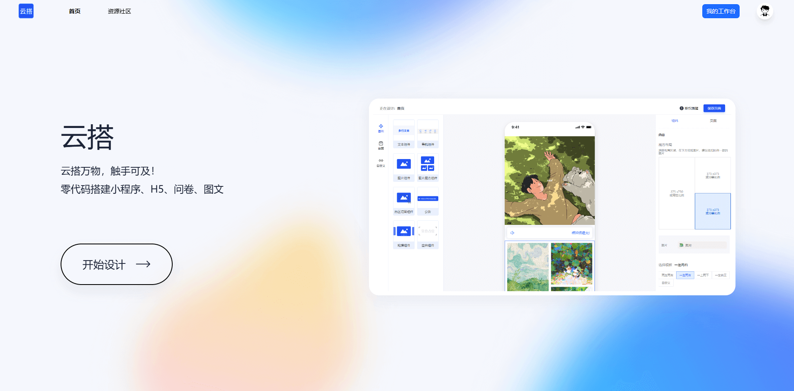
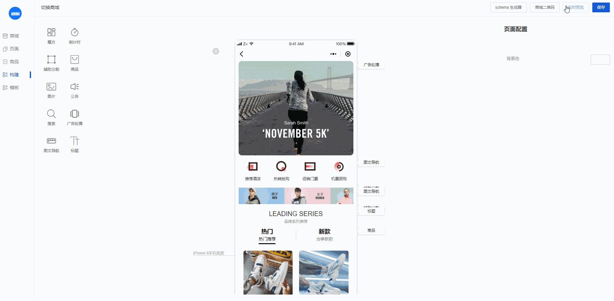
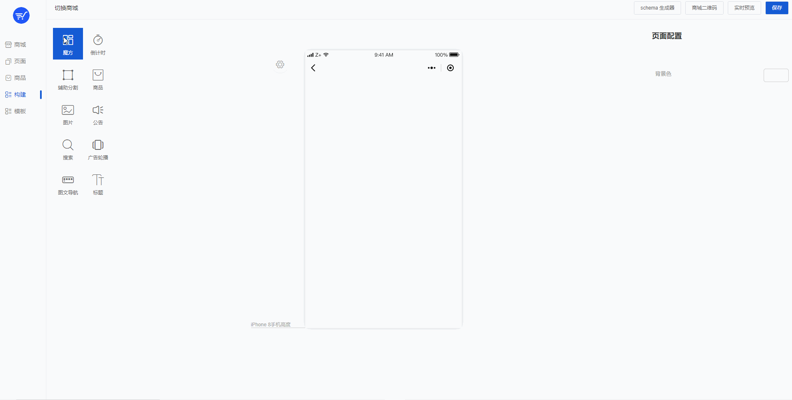
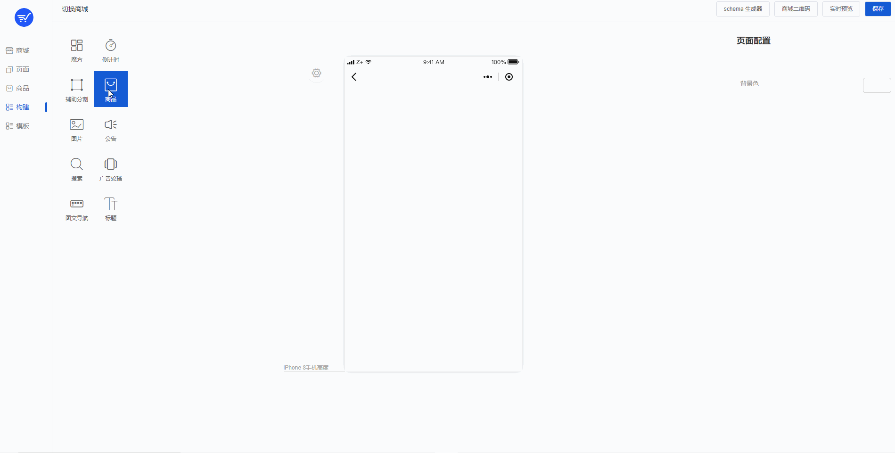
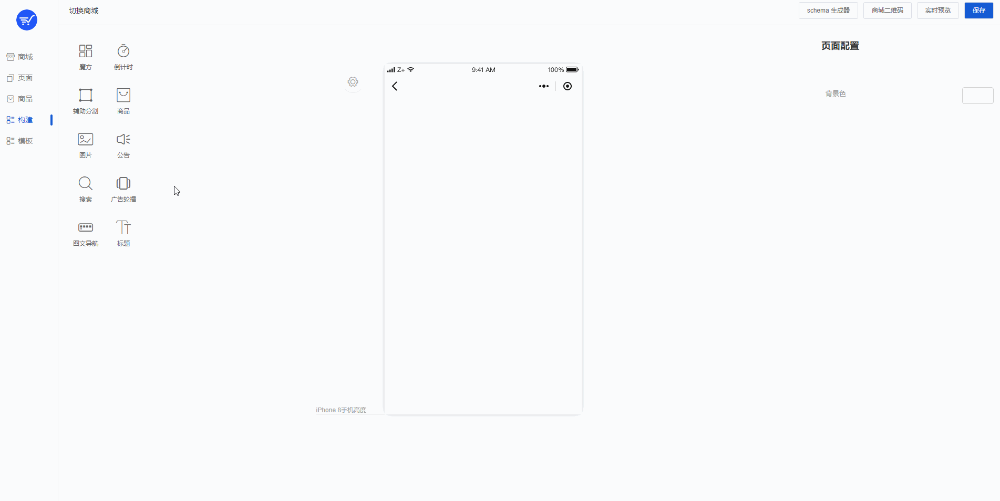
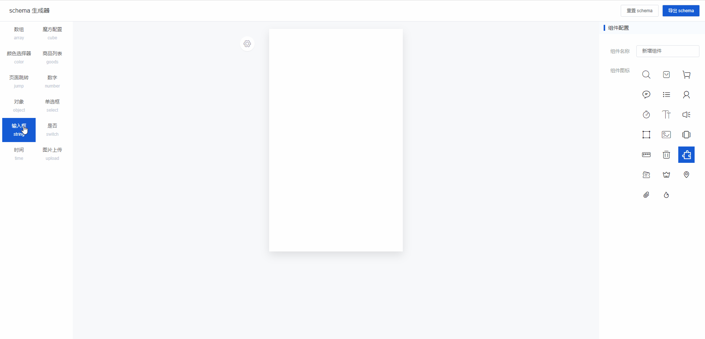
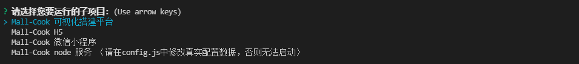

<!--
 * @Description: What's this for
 * @Autor: WangYuan
 * @Date: 2021-12-20 14:20:57
 * @LastEditors: WangYuan
 * @LastEditTime: 2024-11-08 17:20:06
-->
<!-- [English](./README.md) | 简体中文  -->

## 新低代码开源发布

### 云搭

云搭是一款功能强大、开源、免费的可视化搭建解决方案，它支持零代码搭建小程序、H5、问卷、图文等多种应用，我致力于提供一套简单、便捷、专业、可靠的多场景零代码平台。



#### 线上平台

<p data-tool="mdnice编辑器" style="font-size: 16px; padding-top: 8px; padding-bottom: 8px; margin: 0; line-height: 26px; color: black;">地址：<a href="https://www.sunmao-design.top/sunmao/admin" style="text-decoration: none; color: #1e6bb8; word-wrap: break-word; font-weight: bold; border-bottom: 1px solid #1e6bb8;">传送门</a></p>

### 开源地址

<p data-tool="mdnice编辑器" style="font-size: 16px; padding-top: 8px; padding-bottom: 8px; margin: 0; line-height: 26px; color: black;">地址：<a href="https://github.com/wangyuan389/yunda" style="text-decoration: none; color: #1e6bb8; word-wrap: break-word; font-weight: bold; border-bottom: 1px solid #1e6bb8;">传送门</a></p>


<p align="center">
  
</p>
<p align="center">
 
 
 
 
</p>

<p align="center">
  SaaS商城平台，通过可视化搭建商城，支持生成H5、小程序多端商城项目
</p>

<p align="center">
  我前端基建梦想的一小步
</p>

## 介绍

Mall-Cook 是一个基于 vue 开发的可视化商城搭建平台，包括多页面可视化构建、Json Schema 生成器（可视化搭建物料控制面板），实现组件流水线式标准接入平台。最新版本使用 uni-app 重构物料、模板项目，支持生成 H5、小程序多端商城。

## 体验

<p data-tool="mdnice编辑器" style="font-size: 16px; padding-top: 8px; padding-bottom: 8px; margin: 0; line-height: 26px; color: black;">平台地址：<a href="http://110.41.150.71:8000/#/login" style="text-decoration: none; color: #1e6bb8; word-wrap: break-word; font-weight: bold; border-bottom: 1px solid #1e6bb8;">传送门</a></p>

## 文档
<p data-tool="mdnice编辑器" style="font-size: 16px; padding-top: 8px; padding-bottom: 8px; margin: 0; line-height: 26px; color: black;">文档地址：<a href="http://110.41.150.71:7000/" style="text-decoration: none; color: #1e6bb8; word-wrap: break-word; font-weight: bold; border-bottom: 1px solid #1e6bb8;">传送门</a></p>

## 平台速览
<figcaption style="margin-top: 10px;margin-bottom: 10px; text-align: center; color: #888; font-size: 14px;">项目可视化搭建</figcaption>


<figcaption style="margin-top: 10px;margin-bottom: 10px; text-align: center; color: #888; font-size: 14px;">页面使用魔方物料</figcaption>


<figcaption style="margin-top: 10px;margin-bottom: 10px; text-align: center; color: #888; font-size: 14px;">页面使用商品物料</figcaption>


<figcaption style="margin-top: 10px;margin-bottom: 10px; text-align: center; color: #888; font-size: 14px;">模板商城使用模板</figcaption>


<figcaption style="margin-top: 10px;margin-bottom: 10px; text-align: center; color: #888; font-size: 14px;">JsonSchema生成器可视化构建属性面板</figcaption>


## 可视化搭建教程

项目从被阮一峰老师推荐到技术周刊，到一天得到 200 个 star 深深的激励了我，感谢大佬们的抬爱。

本着授人以鱼不如授人以渔思想，我决定在项目新建 shelf 分支，正常迭代 Mall-Cook 情况下，从零重构一套"干净"的可视化架构，同时会在掘金同步出教程文章详细讲述关键功能点，带大家一览此类平台从零到架构搭建的整个过程，谢谢大家的支持

<a href="http://110.41.150.71:8090/img/1667354929405.png" style="text-decoration: none; color: #1e6bb8; word-wrap: break-word; font-weight: bold; border-bottom: 1px solid #1e6bb8;">低代码开发系列教程</a>


## 开始

### 1、安装依赖

```bash
yarn bootstrap
```

如果失败，建议单独进入子目录执行`yarn`安装。

### 2、运行项目

```bash
yarn dev
```


## 服务端本地启动方案
 [传送门](./packages/mall-cook-service/README.md)

## 版本更新
 ### 1.1 uni-app 版本上线

- 支持构建 H5、微信小程序多端商城
- 利用 uni-app 重构物料库与模板项目
- 修改为 Monorepo 风格项目结构，支持多个子项目独立存在

### 1.2 增加 service 子项目

- 后端使用 node 开发，mall-cook-service 项目已公布

### 1.3 支持自定义页面 tab 页面设置与跳转

- 构建自定义页面可在 tabbar 设置为 tab 页
- 支持物料固定页、自定义页面、tab 自定义页面，全类型页面跳转

### 1.3.1 新增文档

- 新增文档项目

## 开源不易, 有了您的赞助, 我们会做的更好~

  

## 技术反馈与低代码交流群

- 加入低代码交流群交流
- 获取低代码开发教程文章
- 与作者进行相关交流


