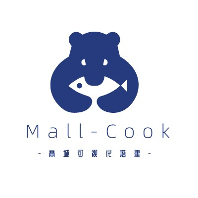

<!--
 * @Description: What's this for
 * @Autor: WangYuan
 * @Date: 2021-12-20 14:20:57
 * @LastEditors: WangYuan
 * @LastEditTime: 2022-02-12 17:24:38
-->
<!-- [English](./README.md) | 简体中文  -->



<div style="display: flex;justify-content: center;width:500px;margin: 0 auto;">
 
 
 
 
</div>

<div style="display: block; text-align: center;margin: 10px 0;">
  SASS商城平台，通过可视化搭建商城，支持生成H5、小程序多端商城项目
</div>

<div style="display: block; text-align: center;margin: 10px 0;">
  我前端基建梦想的一小步
</div>

## 介绍

Mall-Cook 是一个基于 vue 开发的可视化商城搭建平台，包括多页面可视化构建、Json Schema 生成器（可视化搭建物料控制面板），实现组件流水线式标准接入平台。最新版本使用 uni-app 重构物料、模板项目，支持生成 H5、小程序多端商城。

## 1.1 uni-app 版本上线

- 支持构建 H5、微信小程序多端商城
- 利用 uni-app 重构物料库与模板项目
- 修改项目为 [ root -> child project ] 结构，支持多个子项目独立存在

## 体验

<p data-tool="mdnice编辑器" style="font-size: 16px; padding-top: 8px; padding-bottom: 8px; margin: 0; line-height: 26px; color: black;">预览地址：<a href="http://110.42.184.128:8000/#/login" style="text-decoration: none; color: #1e6bb8; word-wrap: break-word; font-weight: bold; border-bottom: 1px solid #1e6bb8;">传送门</a></p>

<figcaption style="margin-top: 10px;margin-bottom: 10px; text-align: center; color: #888; font-size: 14px;">项目可视化搭建</figcaption>


<figcaption style="margin-top: 10px;margin-bottom: 10px; text-align: center; color: #888; font-size: 14px;">页面使用魔方物料</figcaption>


<figcaption style="margin-top: 10px;margin-bottom: 10px; text-align: center; color: #888; font-size: 14px;">页面使用商品物料</figcaption>


<figcaption style="margin-top: 10px;margin-bottom: 10px; text-align: center; color: #888; font-size: 14px;">模板商城使用模板</figcaption>


<figcaption style="margin-top: 10px;margin-bottom: 10px; text-align: center; color: #888; font-size: 14px;">JsonSchema生成器可视化构建属性面板</figcaption>


## 可视化搭建教程

项目从被阮一峰老师推荐到技术周刊，到一天得到 200 个 star 深深的激励了我，感谢大佬们的抬爱。

本着授人以鱼不如授人以渔思想，我决定在项目新建 shelf 分支，正常迭代 Mall-Cook 情况下，从零重构一套"干净"的可视化架构，同时会在掘金同步出教程文章详细讲述关键功能点，带大家一览此类平台从零到架构搭建的整个过程，谢谢大家的支持

<figcaption style="margin-top: 10px;margin-bottom: 10px; text-align: center; color: #888; font-size: 14px;">Mall-Cook平台架构</figcaption>


<p data-tool="mdnice编辑器" style="font-size: 16px; padding-top: 8px; padding-bottom: 8px; margin: 0; line-height: 26px; color: black;">可视化搭建教程体验项目：<a href="http://110.42.184.128:7000/#/" style="text-decoration: none; color: #1e6bb8; word-wrap: break-word; font-weight: bold; border-bottom: 1px solid #1e6bb8;">传送门</a></p>

<p data-tool="mdnice编辑器" style="font-size: 15px; padding-top: 8px; padding-bottom: 8px; margin: 0; line-height: 26px; color: black;"><a href="https://juejin.cn/post/7040993073437868063" style="text-decoration: none; color: #1e6bb8; word-wrap: break-word; font-weight: bold; border-bottom: 1px solid #1e6bb8;">商城可视化搭建平台 Mall-Cook详细介绍</a></p>

<p data-tool="mdnice编辑器" style="font-size: 15px; padding-top: 8px; padding-bottom: 8px; margin: 0; line-height: 26px; color: black;"><a href="https://juejin.cn/post/7044432832965378061/" style="text-decoration: none; color: #1e6bb8; word-wrap: break-word; font-weight: bold; border-bottom: 1px solid #1e6bb8;">手把手带你开发一个低代码可视化平台（一） 实现拖拽搭建面板</a></p>

<p data-tool="mdnice编辑器" style="font-size: 15px; padding-top: 8px; padding-bottom: 8px; margin: 0; line-height: 26px; color: black;"><a href="https://juejin.cn/post/7046924227340926983" style="text-decoration: none; color: #1e6bb8; word-wrap: break-word; font-weight: bold; border-bottom: 1px solid #1e6bb8;">手把手带你开发一个低代码可视化平台（二） 物料JSON构建属性面板流水线</a></p>

<p data-tool="mdnice编辑器" style="font-size: 15px; padding-top: 8px; padding-bottom: 8px; margin: 0; line-height: 26px; color: black;"><a href="https://juejin.cn/post/7049149768328544270" style="text-decoration: none; color: #1e6bb8; word-wrap: break-word; font-weight: bold; border-bottom: 1px solid #1e6bb8;">手把手带你开发一个低代码可视化平台（三） 组件物料复合类型属性</a></p>

## 特性

- 项目基于 VUE 语言开发
- 暂支持生成 H5 商城，后续提供生成小程序商城
- 生成商城支持屏幕适配
- 提供物料 Json Schema 生成器，根据 Json 自动生成配置栏
- 提供多页面搭建
- 提供模板商城，可直接套用模板构建商城
- 自定义底部 tab 菜单
- 支持生成 H5、小程序多端商城

## 启动

root 项目选择需运行的子项目

```bash
$ npm run dev         # 开发
```


## 结构

```javascript
├─ packages                             // 子项目包
│  ├─ mall-cook-platform                    // 可视化搭建平台项目
│  └─ mall-cook-template                    // unn-app模板项目
├─ scripts                              // root脚本
└─ package.json
```

## to do list

- 持续业务组件开发
- 探索平台接入 NPM 组件

## Mall-Cook 交流群

大家可以加群交流低代码/零代码可视化搭建

